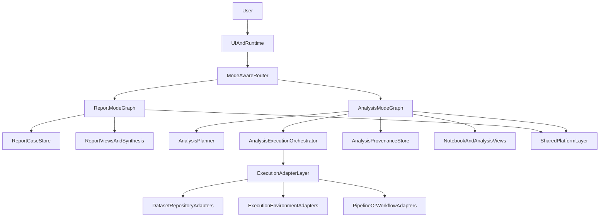
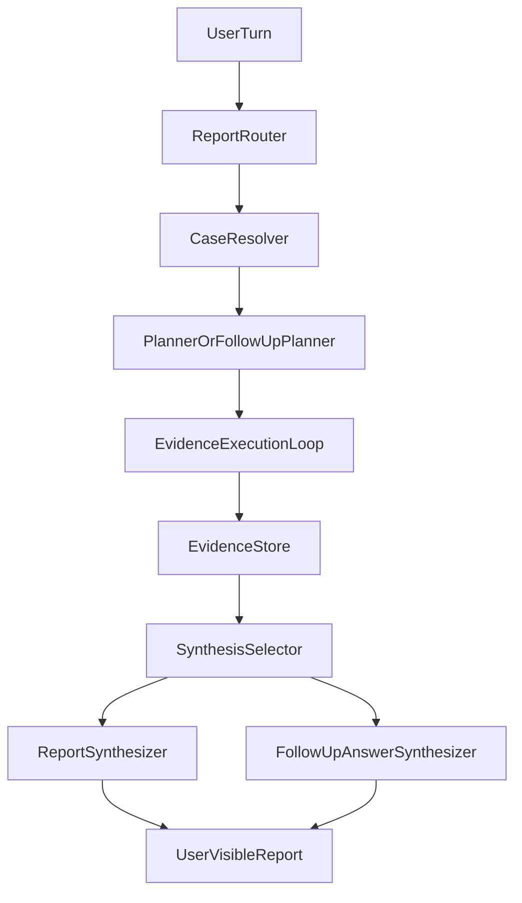
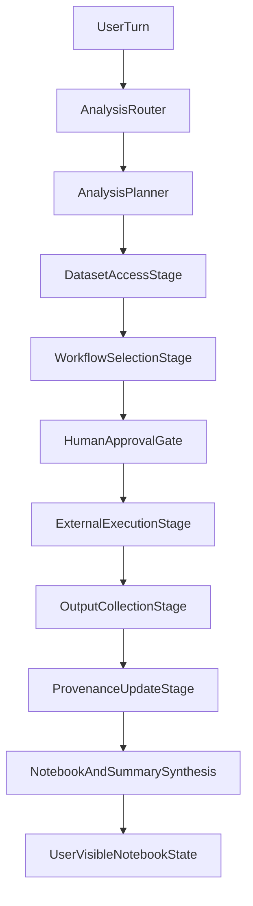

# DESIGN_SPEC.md

## Overview
AI Co-Scientist is an ADK-based biomedical research system with two first-class product modes:

- `report` mode: evidence gathering and synthesis for biomedical research questions that should end in a cited written report
- `analysis` mode: orchestration of reproducible dataset-centric scientific workflows over approved external tools, environments, and platforms

The current implementation already contains working versions of both modes, but they are at different levels of maturity. `report` mode is the primary production workflow and should remain close to the current user experience. `analysis` mode currently has only the first layer of dataset discovery and notebook synthesis, but its target design is broader: it should become an orchestrator for dataset access, reproducible execution environments, QC, preprocessing, downstream analysis, provenance capture, and human review checkpoints.

This document is the source of truth for future architectural changes. It defines what is shared across modes, what must remain mode-specific, how evidence and provenance should be represented, and how future refactors should be judged.

## Product Goals

### Shared goals
- Provide a high-quality ADK-native user experience with clear routing, explicit workflow progress, and recoverable state.
- Prefer tool-grounded work over unsupported freeform model reasoning for tasks that depend on external evidence.
- Preserve provenance, intermediate reasoning products, and user-visible outputs in a way that supports follow-up questions and iterative work.
- Allow human review at meaningful checkpoints rather than forcing the user to trust opaque multi-step execution.

### Report mode goals
- Investigate biomedical questions using live databases, literature, and structured sources.
- Accumulate evidence across multiple user turns into one evolving case by default.
- Synthesize a report that can be regenerated or updated as evidence changes.
- Support follow-up questions without forcing the user into a brittle restart-or-branch model.

### Analysis mode goals
- Discover or ingest existing public datasets and identify the correct modality and workflow family.
- Use approved external tools and environments for QC, preprocessing, and domain-specific analysis.
- Capture provenance, execution metadata, reports, metrics, and artifacts from external runs.
- Act as an orchestrator, not as an ad hoc scientific compute engine.

## Current Implementation Baseline
The current repository already provides:

- a top-level ADK router with specialist agents
- a report-oriented `planner -> loop executor -> synthesizer` workflow
- an initial `analysis` mode variant that emphasizes dataset discovery, metadata inspection, and notebook-oriented synthesis
- repo-local planner, execution, and report-follow-up skills
- a custom FastAPI runtime that manages sessions, persistence, and progress reporting around ADK `Runner`

These existing behaviors are the implementation baseline, but this specification may deliberately redefine some boundaries when the current architecture is too rigid.

## Architectural Principles

### 1. Modes are product-level concepts
`report` and `analysis` are not just prompt variations. They represent different user intents, different tool policies, different state models, and potentially different orchestration graphs.

### 2. Share only what is naturally generic
Common utilities should be shared only when they remain simple, stable, and semantically correct across modes. Code should not be shared merely to avoid duplication.

### 3. Separate orchestration from execution
The ADK agents should plan, route, coordinate, check conditions, and summarize. They should not directly replace established scientific tooling for QC, preprocessing, or downstream domain analysis.

### 4. Separate evidence/provenance from presentation
Reports and notebook summaries are views over accumulated evidence and execution history. They are not the canonical source of truth.

### 5. Prefer explicit structural boundaries over prompt-only constraints
If a mode should not use a tool, state field, or sub-agent, that should be enforced by graph construction and tool profiles wherever practical, not only by instructions.

### 6. Human review is a control surface, not an exception
The design should support approval, revision, continuation, and interpretation checkpoints as first-class workflow events.

## Shared Platform Capabilities
These capabilities are shared across modes unless explicitly overridden:

- ADK runtime integration
- user/session management
- progress and status event streaming
- common error handling
- common retry and backoff helpers
- common tool/adaptor registration
- shared generic agents where behavior is truly identical, such as `general_qa` and `clarifier`
- repo-local skills and prompt resources

The shared platform layer may also contain:

- MCP connection helpers
- common state serialization helpers
- common artifact/provenance APIs
- reusable human-approval helpers

The shared layer must not force a shared workflow graph.

## Top-Level Target Architecture
The target architecture is:

## Mode Routing
The system must retain a single top-level UX entrypoint while keeping mode semantics explicit.

### Required behavior
- The UI or API selects the active workflow mode explicitly.
- Each mode has its own mode-aware router policy and sub-agent graph.
- In-progress workflow commands bypass unnecessary LLM routing when state is sufficient to determine intent.
- A mode switch is a semantic transition and may require state translation or a fresh workflow context.

### Non-goal
- A single universal graph that tries to do both report and analysis equally well.

## Report Mode

### Purpose
`report` mode answers biomedical research questions by accumulating tool-grounded evidence and synthesizing that evidence into an evolving written report.

### What remains stable from the current system
- router-based entry into a research workflow
- planning before execution
- loop-based evidence gathering
- explicit finalize/continue approval mechanics
- post-report follow-up support

### What must change conceptually
The current report workflow behaves too much like a sequence of separate research cycles with a final report artifact attached to each cycle. The target model is a single evolving evidence case by default.

#### Canonical report-mode entities
- `report_case`: the persistent unit of work for a user’s ongoing investigation
- `evidence_store`: structured accumulated findings, claims, sources, tool outputs, and derived observations
- `report_view`: a synthesized rendering of the current evidence store for a specific purpose, such as a concise answer, expanded report, comparison table, or revised section
- `follow_up_request`: a user request that adds to, filters, reinterprets, or resynthesizes the current case

#### Default semantics
- A follow-up question should enrich the same `report_case` unless the user explicitly starts a new investigation.
- Evidence gathered in later turns should be merged into the case rather than treated as a detached mini-workflow.
- Final synthesis should be regenerable from the evidence store, not treated as a one-shot static endpoint.

### Report-mode target flow

### Required report-mode capabilities
- Maintain one active evidence case per conversation by default.
- Distinguish between:
  - new evidence collection
  - reinterpretation of existing evidence
  - restructuring or resynthesis of an existing report
  - explicit request to start a new case
- Allow follow-up queries to:
  - ask for clarification about existing findings
  - request another pass on a weak part of the evidence base
  - add a new comparison dimension or new candidate entity
  - regenerate the report in a different structure or scope

### Evidence store requirements
The report evidence store should capture, at minimum:

- objective and case identity
- normalized entities under investigation
- structured findings
- supporting identifiers such as PMIDs, DOIs, NCT IDs, accessions, dataset IDs, or source-native identifiers
- claims and claim status
- tool calls and provenance
- open gaps and unresolved questions
- per-step summaries and reasoning traces where still useful
- synthesis metadata describing which evidence snapshot was used to produce a given report view

### Report synthesis requirements
- The canonical report should be generated from the current evidence snapshot.
- The system should support multiple synthesis views over the same case, such as:
  - executive summary
  - long-form report
  - evidence table
  - limitations-only update
  - follow-up answer grounded in current case state
- A follow-up question should not require discarding prior evidence or restarting planning unless the user explicitly requests a new case.

### Follow-up routing rules
By default, a post-report follow-up should resolve to one of four actions:

1. answer from existing evidence only
2. resynthesize existing evidence into a different view
3. collect additional evidence and then resynthesize
4. start a new report case only when the request is materially new

### Branching policy
The default model is a single evolving case, not automatic branching.

Optional future capability:
- allow explicit user-created branches for speculative or materially different follow-up paths

But branching is not required for v1 of this design. The system should first become strong at maintaining one coherent evolving case.

## Analysis Mode

### Purpose
`analysis` mode orchestrates dataset-centric scientific workflows over approved external systems. It is not a thin variation of report mode and must be free to use different agents, tools, and orchestration patterns.

### Target mental model
The agent is responsible for:

- planning
- dataset selection and eligibility checks
- workflow selection
- parameter filling from approved templates
- launching tools or workflows
- collecting outputs and provenance
- deciding whether to retry, branch, escalate, or request approval
- summarizing results and limitations

External approved software is responsible for:

- QC
- preprocessing
- modality-specific scientific analysis
- deterministic computation

### Analysis concerns to separate
The architecture must separate these three concerns:

1. dataset access
2. reproducible execution environment
3. workflow/pipeline orchestration

These concerns may interact, but they must not collapse into one monolithic prompt-driven loop.

### Analysis-mode target entities
- `analysis_case`: the top-level unit of dataset-centric work
- `dataset_record`: normalized metadata for a candidate or selected dataset
- `execution_plan`: the approved intended workflow, tool family, parameters, and required approvals
- `run_record`: one concrete execution attempt in an external environment
- `provenance_record`: normalized metadata about dataset version, environment, pipeline version, parameters, outputs, timestamps, approvals, and checks
- `analysis_view`: notebook cells, summaries, comparison tables, interpretation notes, and execution reports derived from the case state

### Analysis-mode target flow

### Execution substrate policy
The design is platform-agnostic. The core orchestration layer must define stable interfaces and adaptors rather than binding the architecture to one platform.

#### Repository/data-source adaptors
- OpenNeuro
- DANDI
- future repository connectors as needed

#### Execution-environment adaptors
- Neurodesk
- future container or remote execution environments

#### Optional orchestration/platform adaptors
- Brainlife or similar remote job orchestration systems

### Analysis-mode allowed role of ADK agents
ADK agents may:

- inspect dataset metadata
- decide which approved workflow family applies
- choose from approved pipeline templates
- request human approval
- launch external jobs through approved adaptors
- collect and summarize results
- compare outcomes or reroute after failures

ADK agents may not:

- improvise unapproved scientific workflows
- invent new preprocessing logic on the fly
- silently reinterpret poor-quality outputs as valid
- perform unsupported freeform domain analysis without provenance

### Analysis-mode safety and validity constraints
- Only approved workflow families may be selected.
- Only approved parameter templates or bounded parameter overrides may be used.
- All external runs must write provenance.
- QC failures or ambiguous outputs must trigger explicit handling rules.
- Surprising or high-impact interpretations should require human review before being presented as confident conclusions.

### Example workflow families
The design should support deterministic pipeline selection across modalities such as:

- structural MRI
- fMRI
- diffusion MRI
- EEG/MEG
- NWB electrophysiology

The spec does not require the repository to implement every workflow now. It requires the architecture to support them cleanly.

## Tool and Access Policy

### Core rule
Each mode has an explicit tool profile. Tool access is a graph-construction concern, not only a prompt concern.

### Report-mode tool profile
Report mode may use:
- literature and citation tools
- clinical evidence tools
- structured evidence sources
- selected dataset tools when the user’s report question depends on them
- report-follow-up skill bundles

Report mode must prioritize tools that support evidence accumulation and citable synthesis.

### Analysis-mode tool profile
Analysis mode may use:
- dataset repository discovery and metadata tools
- approved environment and workflow adaptors
- provenance capture tools
- notebook/update tools
- limited literature tools only when literature is explicitly requested or required to resolve a critical metadata or interpretation gap

Analysis mode must not inherit the entire report tool universe by default.

### Shared tool utilities
It is acceptable to share:
- MCP connection builders
- tool adaptor registries
- common normalization helpers
- common provenance writers

It is not acceptable to expose identical tool sets to both modes unless that is a deliberate policy decision.

## State, Evidence, Provenance, and Artifacts

### Shared requirements
- persistent case identity
- explicit mode identity
- reproducible state transitions
- user-visible progress state
- recoverable artifacts and summaries

### Report-mode canonical state
Report mode should maintain:
- active report case metadata
- evidence store
- synthesis metadata
- open gaps
- user approval and workflow progression state

### Analysis-mode canonical state
Analysis mode should maintain:
- active analysis case metadata
- selected and candidate datasets
- workflow/pipeline intent
- external run records
- provenance records
- notebook state and generated analysis views
- approval state

### Artifact policy
Artifacts are first-class outputs and should be addressable independently from rendered UI views.

Examples:
- reports
- notebook cells
- QC reports
- logs
- figures
- metrics
- parameter manifests
- environment manifests

## Human-in-the-Loop Policy

### Shared HITL events
The system should support:
- approve
- revise
- continue
- finalize

### Report-mode HITL focus
- plan approval
- whether more evidence is needed
- whether the current evidence supports a sufficiently confident synthesis
- whether a follow-up should extend the current case or start a new one

### Analysis-mode HITL focus
- approval before launching expensive or consequential external jobs
- approval when QC indicates problems
- approval before interpreting unexpected or high-impact findings
- approval when switching workflow families or parameter templates after failure

## Sharing Boundary

### Components that should stay shared
- runtime shell and common request handling
- common error handling and retry primitives
- common generic agents where behavior is identical
- common MCP/adaptor registration
- common serialization helpers
- common provenance primitives where the schema is shared

### Components that should become mode-specific
- graph builders
- router instructions and routing policy
- tool profiles
- planner instructions
- executor/orchestrator instructions
- synthesis logic
- state schema beyond a minimal shared envelope
- report evidence store implementation
- analysis provenance and run model

### Required code-shape direction
The implementation should move toward explicit builders such as:

- `create_report_workflow_agent()`
- `create_analysis_workflow_agent()`
- `create_workflow_agent(workflow_mode=...)` as a thin dispatcher only

The codebase should not continue to accumulate deep behavioral divergence through growing `if analysis_mode` branches inside one giant graph factory forever.

## Evaluation Criteria

### Shared evaluation expectations
- correct mode routing
- correct command handling
- stable state transitions
- graceful handling of tool failures
- correct human-approval behavior

### Report-mode evaluation expectations
- follow-up questions preserve and enrich the same evidence case by default
- existing evidence can be reused without unnecessary recollection
- new evidence is merged cleanly into the case
- final report views remain consistent with the current evidence snapshot
- report follow-ups feel less rigid and more conversationally continuous than the current cycle model

### Analysis-mode evaluation expectations
- correct dataset/modality classification
- correct workflow-family selection from approved options
- correct use of external execution adaptors
- provenance completeness
- correct checkpointing around QC and surprising findings
- clean separation between orchestration logic and scientific execution

## Migration Notes

### Immediate implementation direction
Future code changes should follow this order:

1. Introduce explicit per-mode tool profiles.
2. Split the current workflow graph builder into report-specific and analysis-specific builders.
3. Define a report evidence-store abstraction separate from final report rendering.
4. Define analysis execution adaptor interfaces and provenance models.
5. Move mode-specific state and synthesis logic behind mode boundaries.

### What does not need to change immediately
- the existing report-mode user experience can remain close to the current implementation while the evidence-store abstraction is introduced
- the existing analysis-mode dataset/notebook workflow can remain as the first concrete `analysis` implementation while the broader orchestrator interfaces are designed

## Success Criteria
This design is successful when:

- `report` and `analysis` are clearly defined as different product modes
- shared logic is limited to genuinely generic platform capabilities
- report follow-up behavior is redesigned around one evolving evidence case by default
- analysis mode is explicitly defined as an orchestrator over approved external systems
- future refactors can cleanly justify when to share components and when to separate them
- the codebase no longer needs to force `analysis` into the same overall graph shape when a different orchestration is cleaner
